# SPIF-Design-Model
Design and extension model for Single Point Incremental Forming - SPIF

## Scope Model

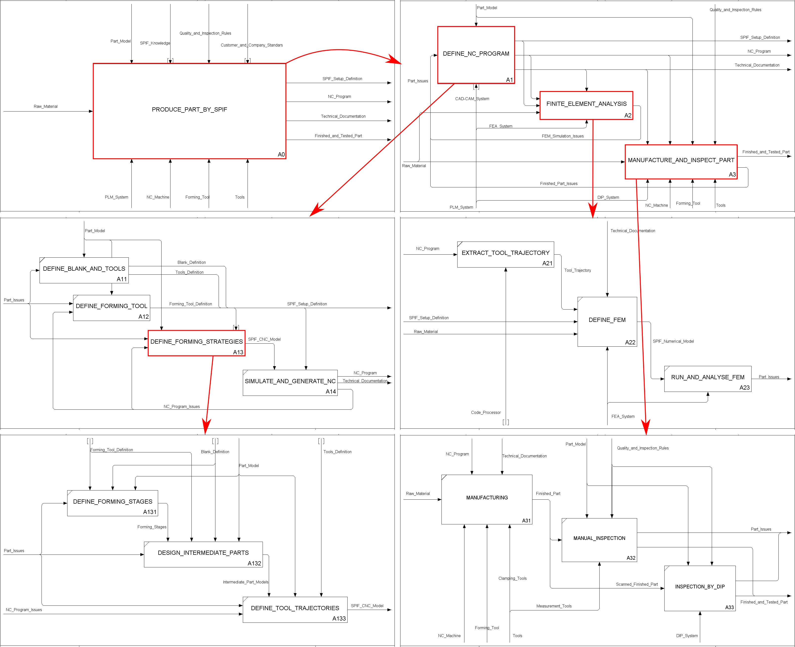

## Data Model

## Behaviour Model

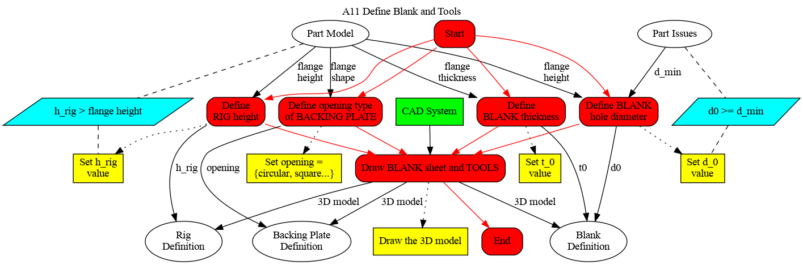

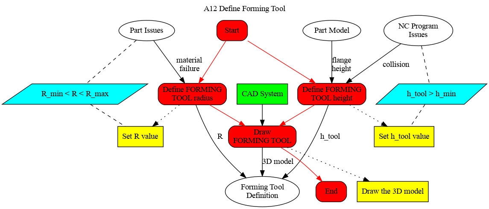

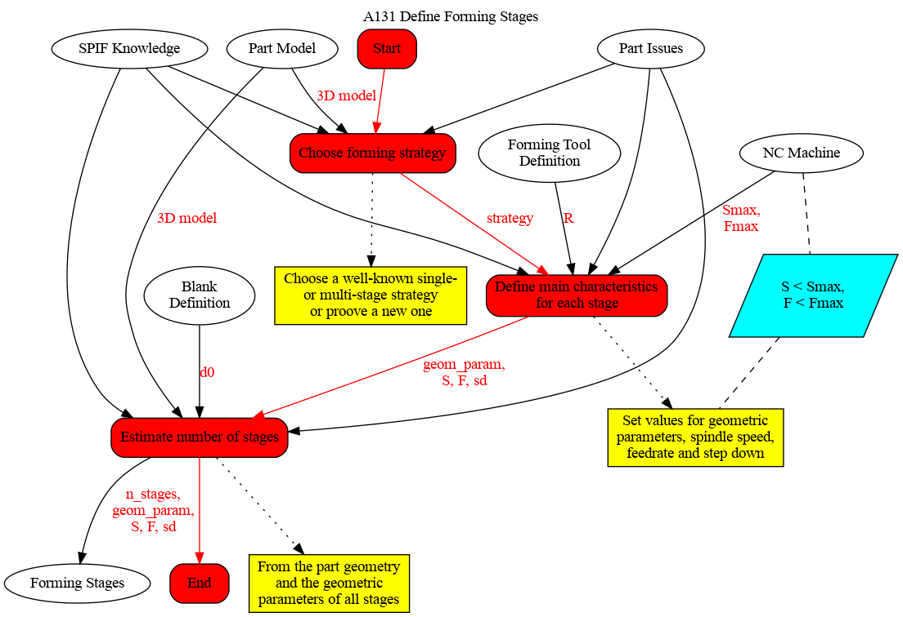

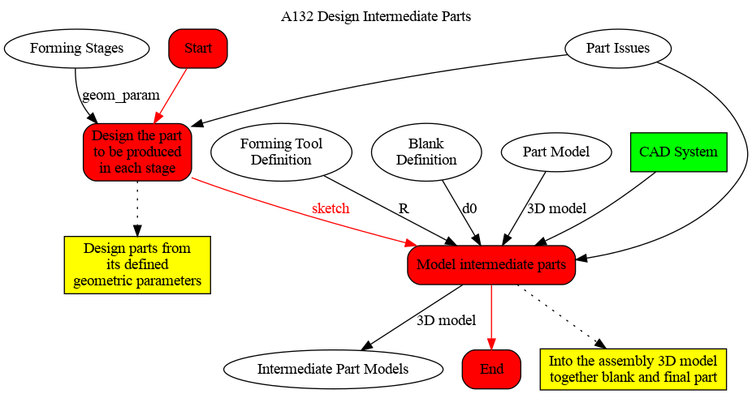

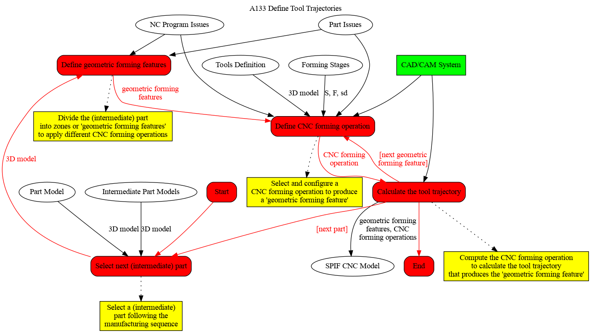

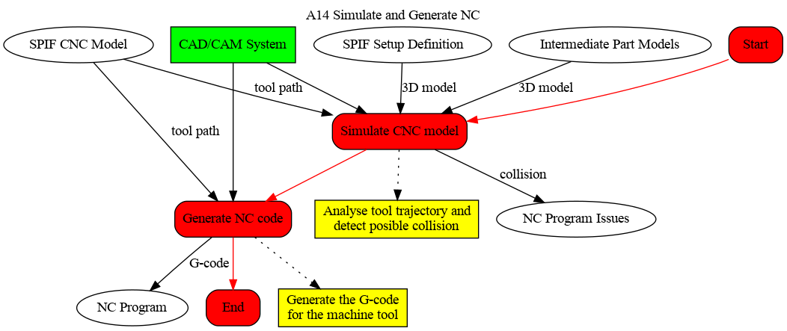

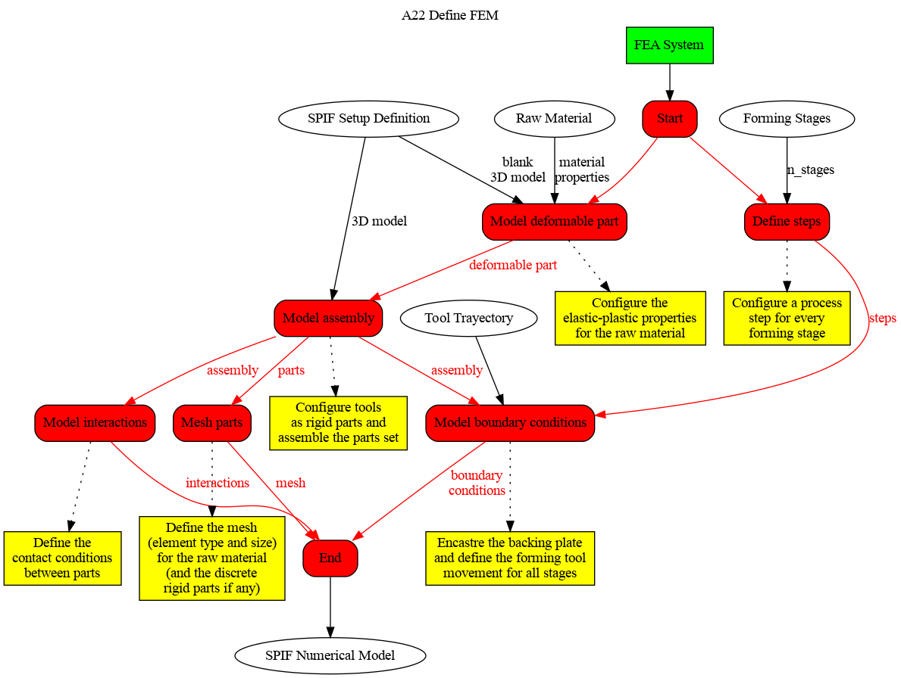

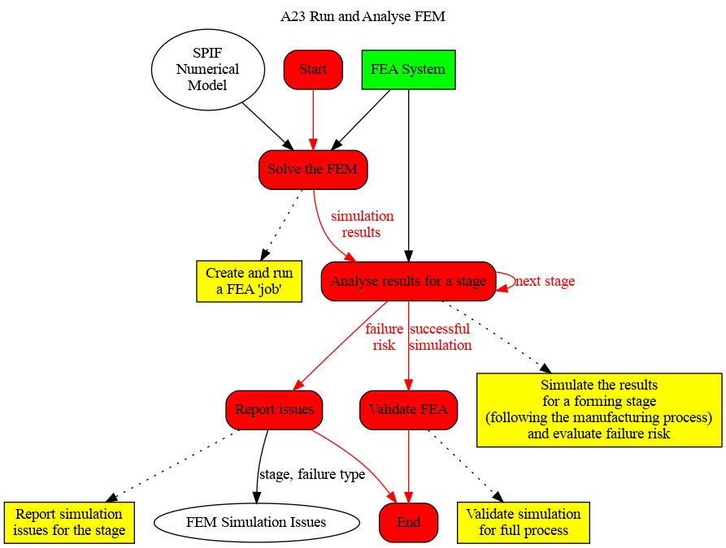

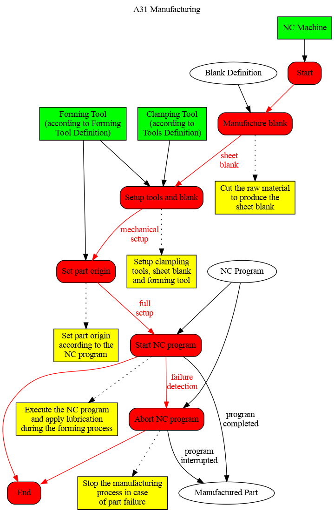

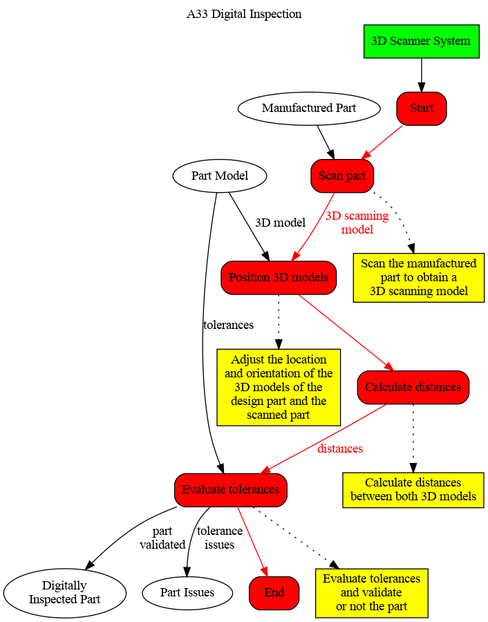

## Overview and required changes to Scope & Data Models

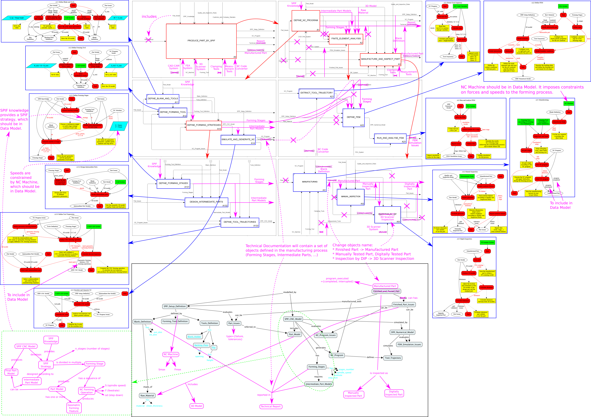

## Meta-Model

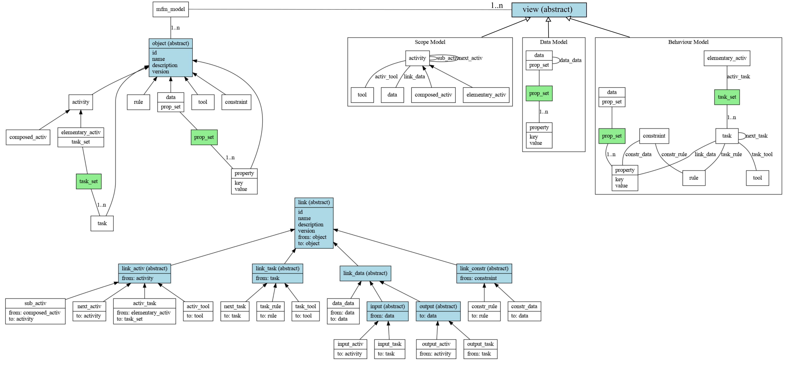

