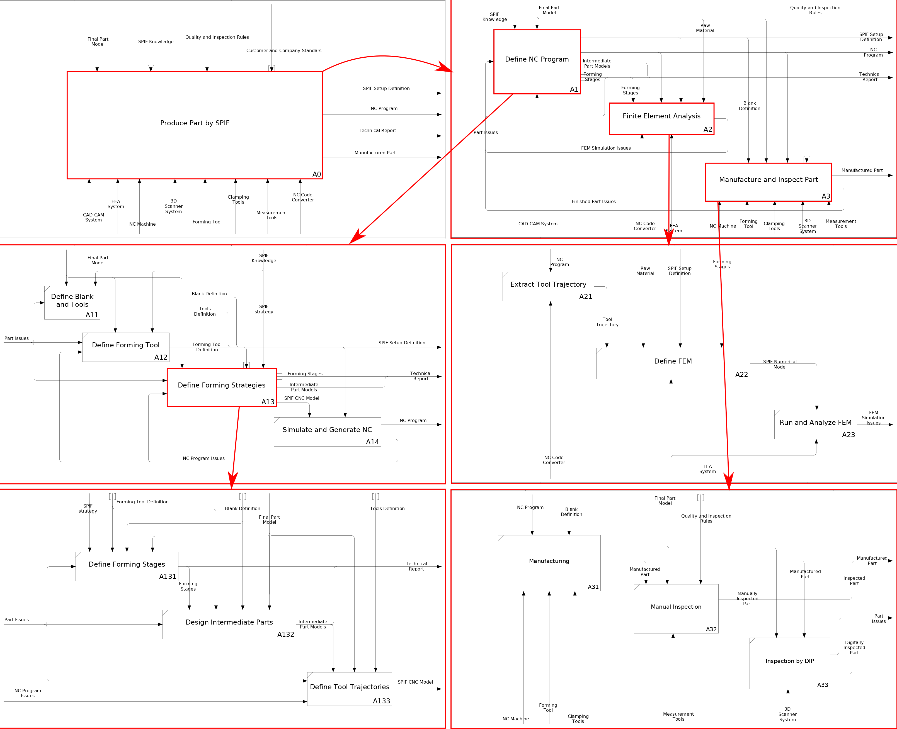
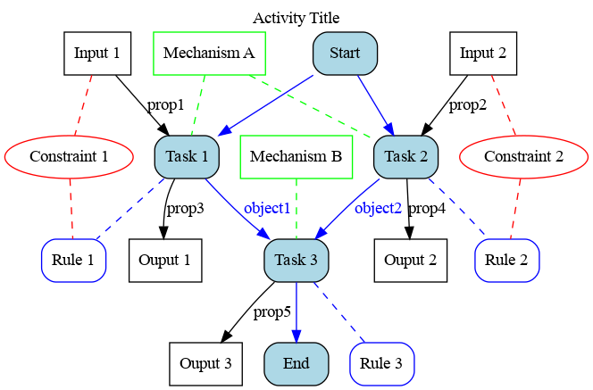

# SPIF-Design-Model
Design and extension model for Single Point Incremental Forming - SPIF

## Scope Model

## Data Model

## Behaviour Model

## Overview and required changes to Scope & Data Models

## Meta-Model

